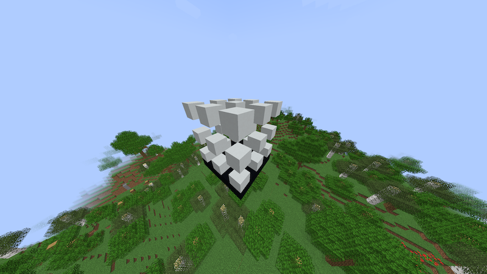
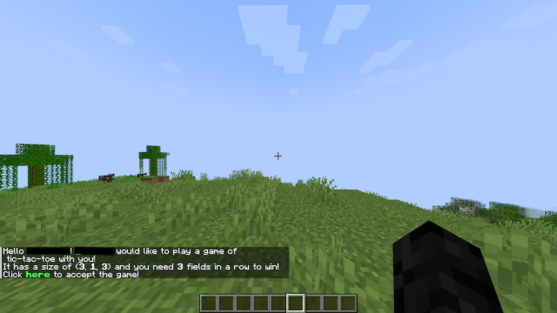
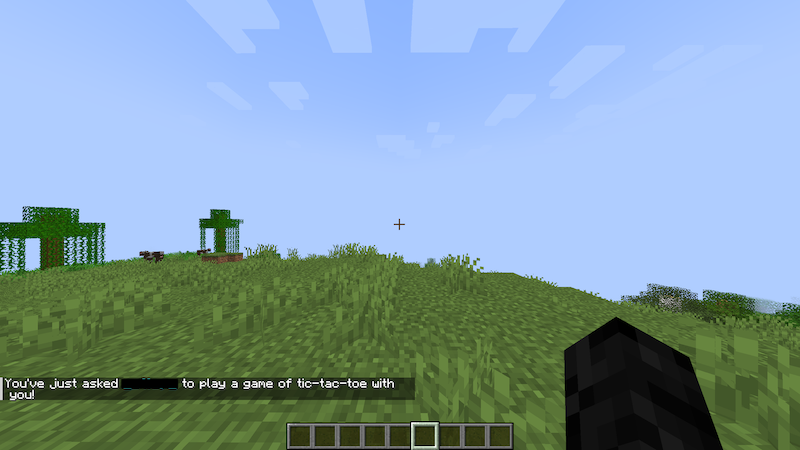
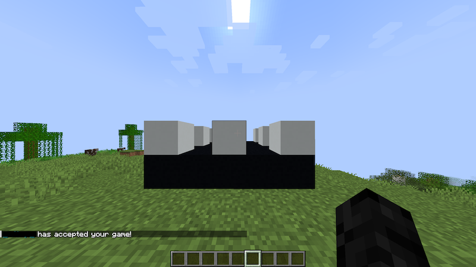
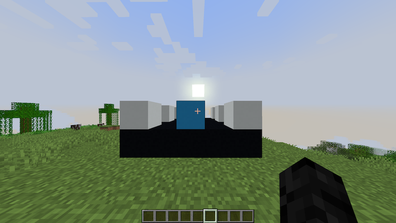
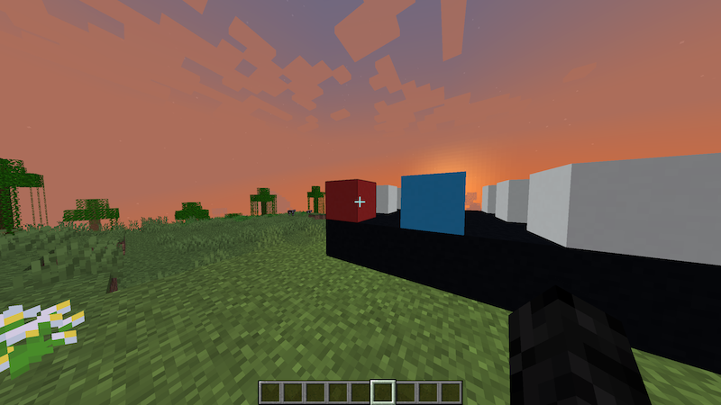

# TicTacToePlugin

## Description
A Minecraft [Spigot](https://www.spigotmc.org/) plugin for playing "Tic-Tac-Toe 2D/3D" against other players.
Games can be both *two-dimensional* (2D) and *three-dimensional* (3D).
You can customize how many fields a player needs to mark in a row in order to win.

## Keywords

**Main player**: The player who started the game.

**Opponent player**: The player who was invited to the game.

**Field**: A single field in a game of Tic-Tac-Toe that is either marked by one of the two players or neutral. 

## Usage

### Requesting a game

Use the `/tictactoe` command and provide an opponent player (and *optionally* the game's size and *winRequiredAmount*) to start a new game.

Usage: `/tictactoe <opponent: Player> [sizeX = 3] [sizeY = 1] [sizeZ = 3] [winRequiredAmount = 3]`

The smallest possible game has a size of `(2, 1, 2)`.

`winRequiredAmount` is the number of fields that have to be marked by one player (in a row or diagonally) for that player to win. This number must not be larger than the biggest dimension of the game and defaults to exactly that.

After this command has been executed, the opponent player receives a chat invitation message containing the game's size and *winRequiredAmount*. Using that message (or using the `/tictactoeaccept` command and providing the main player's name), they can join the game.

### Starting the game

After the opponent player accepts the game, the plugin places the game into the world (in front of where the player was when first executing the `/tictactoe` command). See [Images](#images) for images of such games.

### Playing the game

The opponent player begins. Taking turns, both players can mark one field at a time by right-clicking the neutral (white) blocks. The main player has the color **red**, and the opponent player has the color **light blue**. The in-world Minecraft blocks are colored according to their state.

Markings that are *"in the air"*, meaning that there are still neutral fields below them, will fall until they *"hit"* a non-neutral block or the bottom of the game.

### Winning the game

As soon as one player marked `winRequiredAmount` fields in a row or diagonally, the game stops, shows the fields that are in a row and tells both players whether they won or whether they lost. In case of a tie, no player wins, and a tie-message appears.

The player who lost (or, in case of a tie, both players) can immediately request a return match using a chat message they received (or the command `/tictactoe requestReturnMatch`).

### Cancelling the game

During a game, both players can cancel it anytime by executing `/tictactoe cancel`.

When a game is canceled, it is removed from the world, and both players receive a chat message stating that the game is over.

In case the plugin destroys part of the world by placing the game, all blocks are restored after the game is finished (mostly).
 
## Installation

Download the latest (older releases are very buggy) **JAR**-file from the releases of this repository (or build the plugin yourself using **maven**) and move it to the `plugins` directory of your Minecraft-server (which has to support spigot plugins). If your server is not hosted locally, you might need to use the **FTP** to transfer the file. 

## Configuration

This plugin uses the default config provided by spigot, located in `plugins/Tic-Tac-Toe/config.yml`.

The configuration contains one key, `max_dimension_size`, with an integer value (default `15`) specifying how large the games on the server are allowed to be.

This can be used to prevent server crashing.

## State

In development. The game should already be playable, but there might still be some bugs!

## Images

### A game of the size (3, 3, 3) with only neutral fields

### A game of the size (3, 1, 3) with 3 marked fields

### The invitation message

### The message you reveice after inviting another player

### After the game was accepted

### The opponent player marked a field

### The main player marked a field

### The opponent player wins the game (view of the main player)

https://github.com/lscgh/TicTacToePlugin/assets/157597991/f9f98390-5761-439e-a50b-03fe227ab41f

### The main player wins a game (view of the main player)

https://github.com/lscgh/TicTacToePlugin/assets/157597991/32fbe9e0-29c5-4957-86cc-2dd219a2ed70

### A game ends with a tie

https://github.com/lscgh/TicTacToePlugin/assets/157597991/bb488688-8eb1-48b0-b920-354ee8c20335

## Sounds

This plugin also makes use of ingame sounds (not audible in the videos).
